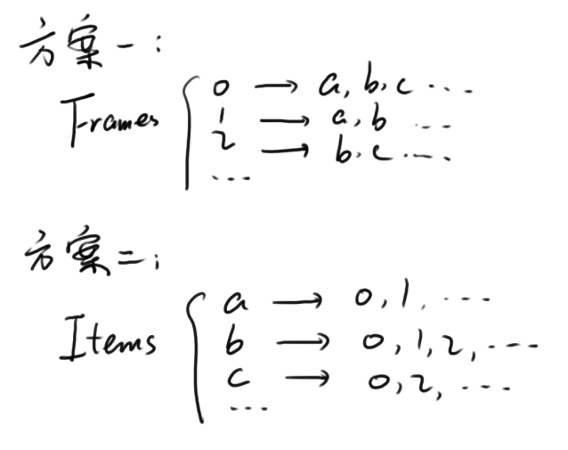
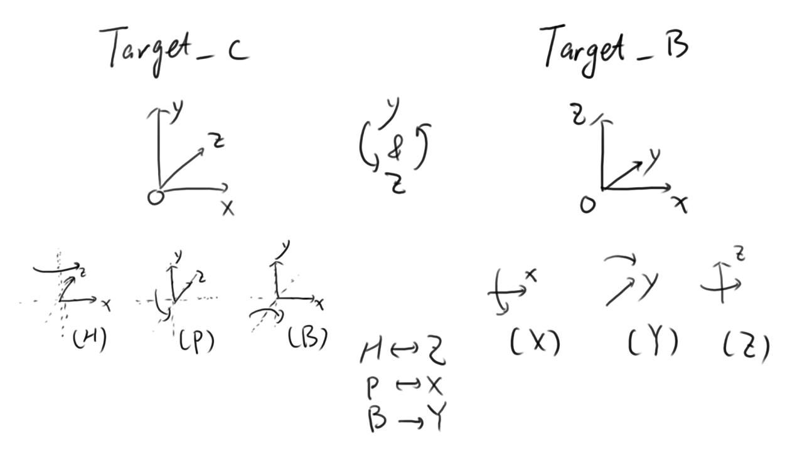

# RigActionRecorder - MC人模动作记录脚本
Blender &lt;bpy> JSON &lt;c4dpy> Cinema 4D

**Do NOT edit files if you DON'T know what it is!!!**

---
### Information - 说明

该项目的定位是一套“跨平台”脚本。最初想法是通过一个媒介，将不同平台不同种类的MC人模的数据进行处理，以此做到互通。

想法挺好，实际操作却越来越难。

考虑到人模功能复杂性，以及对分离控制的处理等问题，本项目暂停一段时间。现在的进度大约为1/4（在C4D中读取人模动作信息）。

未来可能会重构代码和数据结构 ~~（不要哇）~~。

> *按照计划，下一个项目是一个“复刻”，具体内容还请自行搜索。  
> ~~论为啥我要用汉语？因为我英语不行……~~*

---
### Usage - 用法

* 下载zip包并解压。

    > 下载方式：Clone or download -> Download ZIP。

* 打开C4D，导入人模并k帧。

    > 目前仅支持[Varcade](https://www.bilibili.com/video/av83892718 "Voxel-Arcade团队在动画里使用的人模，由游客Yuke制作")人模，如有其他需求可修改prop.json。

* 准备完成后，选中人模整体。

* 打开“脚本 -> 脚本管理器”。（快捷键Shift+F11）

* 在新窗口打开文件“record_c.py”并点击“执行”。

* 按照提示进行操作。

* 最后会输出一份JSON文件，可用记事本打开。

    > 当然，没什么实际用途……

---
### Todo List

* ~~Record bones when using IK & prepare for conversions from different rigs.~~

    > ~~“不是，这个蓝色的不推荐使用，我记得好像跟这个使用的时候会有出BUG之类的问题……”~~  
    > ~~*-- [Varcade](https://www.bilibili.com/video/av83892718?p=3&t=5m35s "“不是，这个蓝色的不推荐使用，我记得好像跟这个使用的时候会有出BUG之类的问题……”")*~~

* ~~Read those JSONs. *(JSON -> C4D)*~~

* Use INI instead of JSON to save properties.

* Learn C4D & Blender APIs.

---
### Screenshots of Designing - 一些截图

> Early design.

> Fixing bugs of "Eye Location".

> Animating a rig & Testing the script. ~~(I prefer using blender.)~~  

.*")

---
### [Something has changed... ?](https://www.bilibili.com/video/av49330021/?t=2m31s "ああ 君は変った")