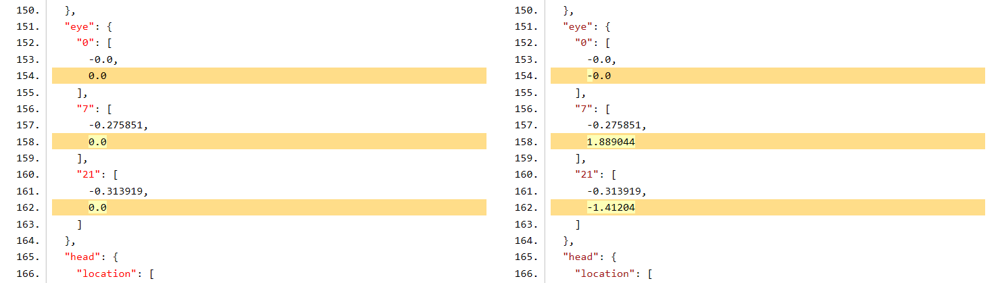
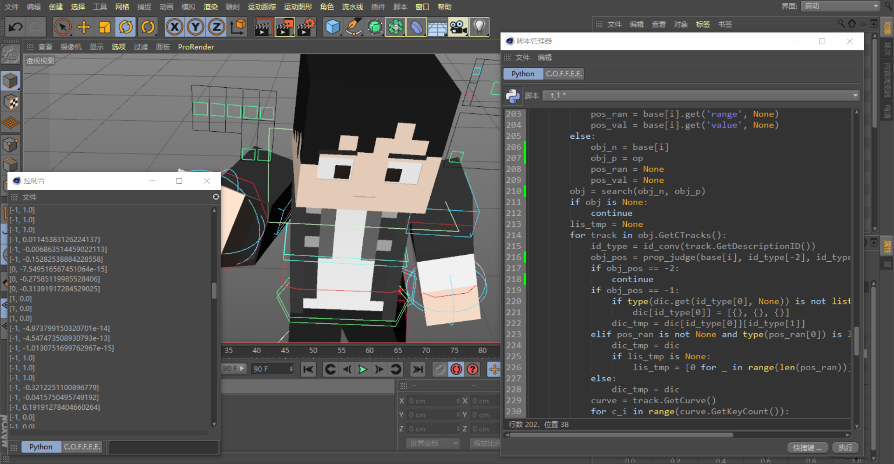

# RigActionRecorder
Blender &lt;bpy> JSON &lt;c4dpy> Cinema 4D

**Do NOT edit files if you DON'T know what it is!!!**

---
### Todo List

* Record bones when using IK & prepare for conversions from different rigs.

> “不是，这个蓝色的不推荐使用，我记得好像跟这个使用的时候会有出BUG之类的问题……”  
> *-- [Varcade](https://www.bilibili.com/video/av83892718?p=3&t=5m35s)*

* Read those JSONs. *(JSON -> C4D)*

* Learn Blender API.

---
### Screenshots from Debugging

> Fixing bugs of "Eye Location".

> Animating a rig & Testing the script. ~~(I prefer using blender.)~~  
> *The rig can be downloaded [here](https://www.bilibili.com/video/av83892718).*
